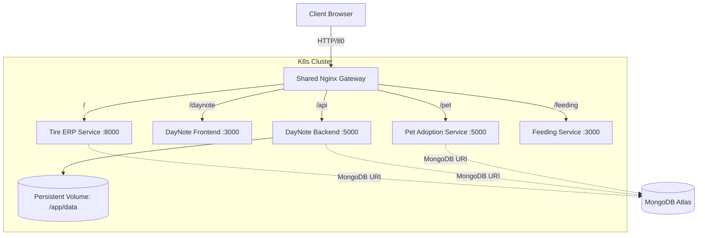

# Multi-Service Kubernetes Infrastructure

This repository contains the Kubernetes infrastructure code (Manifests) for deploying and managing a multi-service application environment. It supports both local development (via Docker Desktop / Minikube) and production deployment (via Google Kubernetes Engine).

## Architecture Overview

The system utilizes a central API Gateway (Nginx) to route traffic to four distinct microservices. It features stateless application nodes backed by a managed MongoDB Atlas cluster and a Persistent Volume Claim (PVC) for durable media storage.



## Microservices Stack

| Service | Framework | Port (ClusterIP) | Description |
|---|---|---|---|
| **Tire ERP** | Python (Django) + Vue | 8000 | Enterprise Resource Planning system for tire inventory. |
| **DayNote** | Next.js (Frontend) / Express (Backend) | 3000 / 5000 | Journaling application with durable image uploads. |
| **Pet Adoption** | Node.js (Express) | 5000 | Pet adoption and signature platform. |
| **Feeding** | Node.js (Express) | 3000 | Feeding tracking application. |

## High Availability & Failover

This infrastructure implements an Active/Passive failover mechanism handled at the Ingress/Gateway level.

- **Gateway Interception:** The `shared-nginx` service intercepts `502 Bad Gateway` and `504 Gateway Timeout` errors from upstream local services.
- **Client-Side Routing:** Upon upstream failure, Nginx serves a fallback HTML page that automatically redirects the client to the production GKE endpoints (`35.221.153.58`) after a 3-second delay, ensuring uninterrupted user experience during local outages.

## Deployment Guide

### Prerequisites
- `kubectl` configured with target cluster context.
- Target cluster must support standard `Service`, `Deployment`, and `PersistentVolumeClaim` resources.
- MongoDB Atlas connection strings.

### Secrets Management
Secrets are managed out-of-tree for security. Before applying manifests, you must provide the database credentials.

1. Copy the example configuration:
   ```bash
   cp secrets.yaml.example secrets.yaml
   ```
2. Populate `secrets.yaml` with your production connection strings.
3. Apply the secrets:
   ```bash
   kubectl apply -f secrets.yaml
   ```

### 1. Local Development (Docker Desktop)
The local environment utilizes `ClusterIP` services routed through the Nginx gateway.

```bash
# Set context
kubectl config use-context docker-desktop

# Apply full stack
kubectl apply -f k8s-full-stack.yaml

# Establish port-forwarding (Binds IPv4/IPv6 to prevent ngrok resolution errors)
kubectl port-forward svc/shared-nginx 80:80 --address 127.0.0.1,::1
```

### 2. Production Deployment (GKE)
The production environment utilizes `LoadBalancer` services to expose endpoints directly.

```bash
# Set context to GKE cluster
kubectl config use-context gke_[PROJECT_ID]_[ZONE]_[CLUSTER_NAME]

# Apply production manifests
kubectl apply -f k8s-prod.yaml

# Force rollout to ensure latest image pulls (bypass ImagePullPolicy cache)
kubectl rollout restart deployment tire-erp
```

## Maintenance & Cost Optimization

To optimize costs in the GCP environment during non-business hours, node pools are managed via Google Cloud Scheduler.

- **Scale Up (0 20 * * *):** Resizes `default-pool` to 1 node via GKE REST API.
- **Scale Down (0 2 * * *):** Resizes `default-pool` to 0 nodes via GKE REST API.

*Note: Infrastructure definitions are maintained by the DevSecOps team. Do not commit `.env` or `secrets.yaml` to this repository.*
